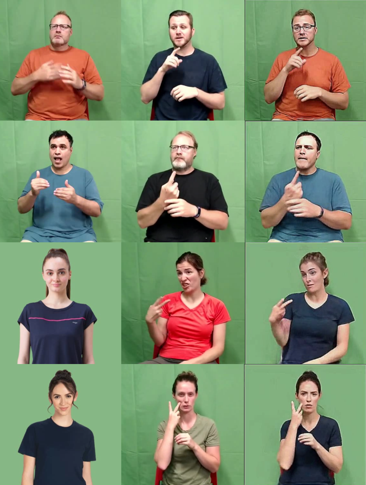

# A Sign Language Deepfake Dataset

<div align="center">
    
    <p></p>
</div>

<div align="center">
    <a href="https://github.com/ControlNet/AV-Deepfake1M/issues">
        
    </a>
    <a href="https://github.com/snaeemm/SLDF/network/members">
        
    </a>
    <a href="https://github.com/snaeemm/SLDF/stargazers">
        
    </a>
    <a href="https://github.com/snaeem/SLDF/blob/master/LICENSE">
        
    </a>
    <a href="https://arxiv.org/abs/2311.15308">
        
    </a>
</div>

This is the official repository for the paper 
[Generation and Detection of Sign Language Deepfakes - A Linguistic and Visual Analysis](http://arxiv.org/abs/2311.15308).

## Abstract
A question in the realm of deepfakes is slowly emerging pertaining to whether we can go beyond
facial deepfakes and whether it would be beneficial to society. Therefore, this research presents a positive
application of deepfake technology in upper body generation, while performing sign-language
for the Deaf and Hard of Hearing (DHoH) community. The resulting videos are later vetted with
a sign language expert. This is particularly helpful, given the intricate nature of sign language, a
scarcity of sign language experts, and potential benefits for health and education. The objectives of
this work encompass constructing a reliable deepfake dataset, evaluating its technical and visual credibility
through computer vision and natural language processing models, and assessing the plausibility
of the generated content. With over 1200 videos, featuring both previously seen and unseen individuals
for the generation model, using the help of a sign language expert, we establish a deepfake dataset
in sign language that can further be utilized to detect fake videos that may target certain people of
determination. The expert annotations reveal that the generated fake videos are comparable to real
sign language videos.Linguistic analysis, employing textual similarity scores and interpreter evaluations,
reveals promising similarity between authentic and fraudulent sign language videos where in
the interpretation of a fake is atleast 90% the same as the real video. Visual analysis demonstrates
that visually convincing deepfake videos can be produced, even with entirely new subjects using our
approach. Leveraging a pose/style transfer model for video generation, our method pays meticulous
attention to detail, producing hands in a manner that allows interpretability, while closely matching
the driving video. We further apply machine learning algorithms to establish a baseline performance
on the dataset for deepfake detection.

## Dataset

### Download

### Metadata Structure

## License

The dataset is under the [EULA](eula.pdf). You need to agree and sign the EULA to access the dataset.

The other parts of this project is under the CC BY-NC 4.0 license. See [LICENSE](LICENSE) for details.

## References

If you find this work useful in your research, please cite it.

```bibtex
@article{cai2023avdeepfake1m,
  title = {AV-Deepfake1M: A Large-Scale LLM-Driven Audio-Visual Deepfake Dataset},
  action = {Cai, Zhixi and Ghosh, Shreya and Adatia, Aman Pankaj and Hayat, Munawar and Dhall, Abhinav and Stefanov, Kalin},
  journal = {arXiv preprint arXiv:2311.15308},
  year = {2023},
}
```
